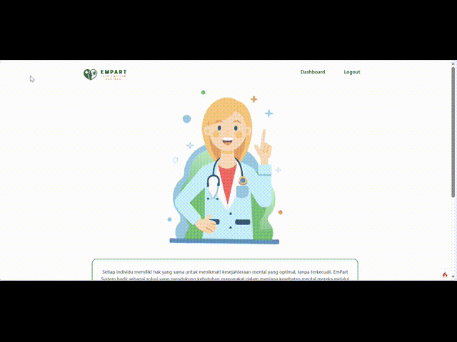

# About App

This is an expert system project for detecting depressive disorders, equipped with diagnostic results, activity recommendations, and also a dashboard for monitoring test results periodically. All knowledge bases used are sourced from experts.

## Demo App



# CodeIgniter 4 Application Starter

## What is CodeIgniter?

CodeIgniter is a PHP full-stack web framework that is light, fast, flexible and secure.
More information can be found at the [official site](https://codeigniter.com).

This repository holds a composer-installable app starter.
It has been built from the
[development repository](https://github.com/codeigniter4/CodeIgniter4).

More information about the plans for version 4 can be found in [CodeIgniter 4](https://forum.codeigniter.com/forumdisplay.php?fid=28) on the forums.

You can read the [user guide](https://codeigniter.com/user_guide/)
corresponding to the latest version of the framework.

## Installation & updates

`composer create-project codeigniter4/appstarter` then `composer update` whenever
there is a new release of the framework.

When updating, check the release notes to see if there are any changes you might need to apply
to your `app` folder. The affected files can be copied or merged from
`vendor/codeigniter4/framework/app`.

## Email Validation Using Gmail SMTP

To use email validation with Gmail's SMTP in CodeIgniter 4, follow these steps:

1. **Configure SMTP Settings in `config/email.php`**  
   Open `app/Config/Email.php` and set the following properties:

   ```php
   public $protocol    = 'smtp';
   public $SMTPHost    = 'smtp.gmail.com';
   public $SMTPUser    = 'your_gmail_address@gmail.com';
   public $SMTPPass    = 'your_gmail_app_password';
   public $SMTPPort    = 587;
   public $SMTPTimeout = 60;
   public $SMTPKeepAlive = true;
   public $mailType    = 'html';
   public $charset     = 'utf-8';
   public $SMTPCrypto  = 'tls';
   ```

2. **Enable "App Passwords" in Gmail**  
   Generate an "App Password" in your Google Account settings and use it as `SMTPPass`.

3. **Send Validation Email**  
   Use CodeIgniter's `Email` class to send a validation email containing a unique link for the user to verify their email address.

4. **Handle Validation**  
   When the user clicks the link, verify the token and activate their account.

Refer to the [CodeIgniter Email documentation](https://codeigniter.com/user_guide/libraries/email.html) for more details.

## Setup

Copy `env` to `.env` and tailor for your app, specifically the baseURL
and any database settings.

## Important Change with index.php

`index.php` is no longer in the root of the project! It has been moved inside the _public_ folder,
for better security and separation of components.

This means that you should configure your web server to "point" to your project's _public_ folder, and
not to the project root. A better practice would be to configure a virtual host to point there. A poor practice would be to point your web server to the project root and expect to enter _public/..._, as the rest of your logic and the
framework are exposed.

**Please** read the user guide for a better explanation of how CI4 works!

## Repository Management

We use GitHub issues, in our main repository, to track **BUGS** and to track approved **DEVELOPMENT** work packages.
We use our [forum](http://forum.codeigniter.com) to provide SUPPORT and to discuss
FEATURE REQUESTS.

This repository is a "distribution" one, built by our release preparation script.
Problems with it can be raised on our forum, or as issues in the main repository.

## Server Requirements

PHP version 7.4 or higher is required, with the following extensions installed:

- [intl](http://php.net/manual/en/intl.requirements.php)
- [mbstring](http://php.net/manual/en/mbstring.installation.php)

> [!WARNING]
> The end of life date for PHP 7.4 was November 28, 2022.
> The end of life date for PHP 8.0 was November 26, 2023.
> If you are still using PHP 7.4 or 8.0, you should upgrade immediately.
> The end of life date for PHP 8.1 will be November 25, 2024.

Additionally, make sure that the following extensions are enabled in your PHP:

- json (enabled by default - don't turn it off)
- [mysqlnd](http://php.net/manual/en/mysqlnd.install.php) if you plan to use MySQL
- [libcurl](http://php.net/manual/en/curl.requirements.php) if you plan to use the HTTP\CURLRequest library
